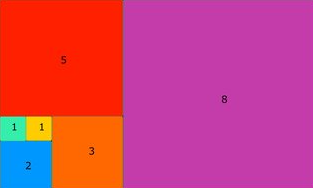

# Kata: [Perimeter of squares in a rectangle](https://www.codewars.com/kata/559a28007caad2ac4e000083)

## Description
You are given a number `n`, where `n + 1` represents the number of squares arranged in a rectangle. The side lengths of these squares are the first `n + 1` numbers of the Fibonacci sequence. Your task is to compute the total perimeter of all these squares.



### Fibonacci Sequence:
The Fibonacci sequence is defined as follows:
- F(0) = 1
- F(1) = 1
- F(n) = F(n-1) + F(n-2) for n >= 2

### Perimeter of a Square:
The perimeter of a square with side length `s` is `4 * s`.

### Example:
For `n = 5`, the side lengths of the squares are the first 6 Fibonacci numbers: 1, 1, 2, 3, 5, 8. The total perimeter is:
```
4 * (1 + 1 + 2 + 3 + 5 + 8) = 4 * 20 = 80
```

For `n = 7`, the side lengths are the first 8 Fibonacci numbers: 1, 1, 2, 3, 5, 8, 13, 21. The total perimeter is:
```
4 * (1 + 1 + 2 + 3 + 5 + 8 + 13 + 21) = 4 * 53 = 212
```

### Task:
Create a function `perimeter` that computes the total perimeter of all the squares given an integer `n`.