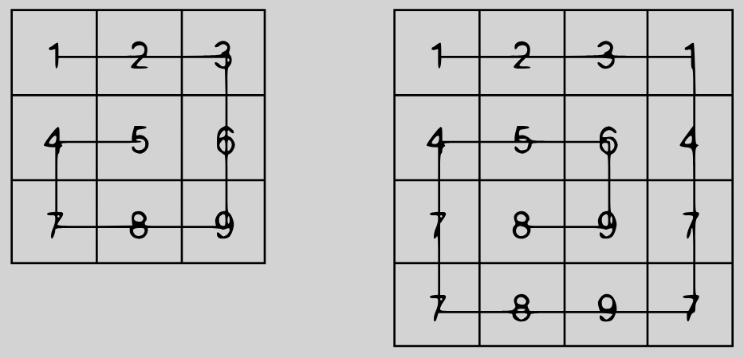

# Kata: [Snail](https://www.codewars.com/kata/521c2db8ddc89b9b7a0000c1)

## Description
Given an `n x n` 2D array (matrix), your task is to return the elements of the matrix arranged from the outermost elements to the middle element, traveling in a clockwise pattern.

### Example
For the input matrix:
```python
array = [[1,2,3],
         [4,5,6],
         [7,8,9]]
snail(array) #=> [1,2,3,6,9,8,7,4,5]
```


### Notes:
- The task is not to **sort** the elements in ascending order, but to traverse the matrix in a clockwise snail-shell pattern.
- If the input is an empty matrix (e.g., `[[]]`), return an empty array.

### Input:
- An `n x n` 2D array of integers.

### Output:
- A 1D array containing the elements of the matrix arranged in a clockwise snail-shell pattern.