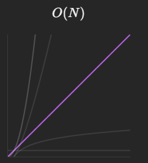
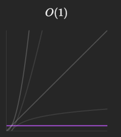

# Problem: [Count Numbers with Unique Digits](https://leetcode.com/problems/count-numbers-with-unique-digits/description/)

[My Solution](https://leetcode.com/problems/count-numbers-with-unique-digits/solutions/5765073/unique-digit-number-counter-with-on-time-complexity/)

## Problem Description
Given an integer `n`, return the count of all numbers with unique digits, `x`, where `0 <= x < 10^n`.

## Examples
**Input:**
```
n = 2
```
**Output:**
```
91
```
**Explanation:**  
There are 100 numbers in the range [0, 100) but excluding numbers like 11, 22, 33, ..., we have 91 numbers with unique digits.

**Input:**
```
n = 0
```
**Output:**
```
1
```
**Explanation:**  
When `n = 0`, the only valid number is `0`.

## Constraints
- `0 <= n <= 8`

## Intuition
To solve the problem of counting numbers with unique digits for a given integer `n`, our goal is to find the total number of numbers in the range `0 ≤ x < 10^n` that have all unique digits.

### Initial Thoughts
We need to account for numbers with different lengths:
- For numbers with `1` digit, all numbers from `0` to `9` are valid.
- For numbers with `2` digits, we need to ensure that each digit is unique and the number does not start with `0`.
- This pattern continues up to `n` digits.

## Approach
1. Calculate Permutations for Each Length:
    - For numbers with exactly `i` digits, compute the number of permutations with unique digits.
    - The first digit cannot be `0` and has 9 options (1 through 9).
    - For the remaining digits, ensure they are unique by decreasing the available choices as more digits are used.

2. Sum Up Results:
    - Iterate over all lengths from `1` to `n` and sum the total number of valid numbers.
    - Include `1` at the end to account for the number `0`.

## Complexity
**Time Complexity:**
The time complexity is (O(n)), where `n` is the number of digits. This is because the algorithm iterates over each length from `1` to `n`, and for each length, it performs a loop that runs in constant time relative to `n`.



**Space Complexity:**
The space complexity is (O(1)) since we are using a constant amount of extra space regardless of the input size.



## Submission Detail
- Runtime: **11 ms**
- Memory Usage: **11.7 MB**